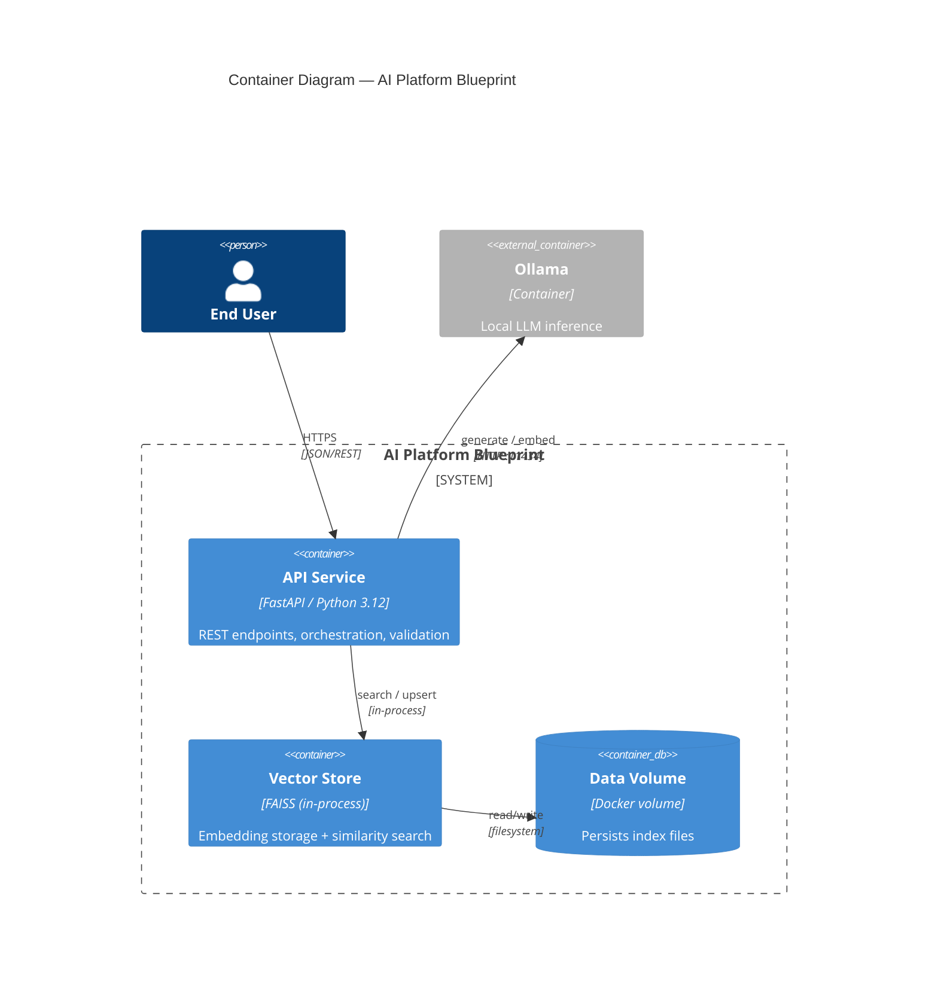

# AI Platform Blueprint

> A production-grade starting point for building AI/LLM platforms: FastAPI
> service, local-first LLM runtime (Ollama), and a vector-search layer
> (FAISS), designed to scale from prototype to production.

[](.github/workflows/ci.yml)
[](pyproject.toml)
[](https://fastapi.tiangolo.com/)
[](LICENSE)

## Overview

AI Platform Blueprint is a reference architecture — not a toy demo — for
teams building products on top of LLMs. It ships with the plumbing most AI
products need on day one:

- A **FastAPI** service with structured logging, typed settings, liveness
  and readiness probes, and a clean layer boundary between API, services,
  and core config.
- A **local-first LLM runtime** via [Ollama](https://ollama.com/), so the
  whole stack runs with `docker compose up` — no API keys, no billing, no
  data leaving your machine (see [ADR-0002](docs/adr/0002-llm-runtime-ollama-vs-external-apis.md)).
- A **vector search** layer built on FAISS for retrieval-augmented
  generation, behind an internal abstraction so the backend can evolve
  without rewriting call sites (see [ADR-0001](docs/adr/0001-vector-store-faiss-vs-qdrant.md)).
- **Architecture decision records (ADRs)** documenting the *why* behind
  every non-obvious choice, and a **C4 model** describing the system at
  three levels of zoom.

**Sprint 1 — Project Foundation** laid the base: FastAPI app, health
probes, config, logging. **Sprint 2 — RAG Pipeline** builds the first
end-to-end retrieval loop on top of it: document ingestion, chunking,
embedding, and a `VectorStore` port with a FAISS adapter behind it. Later
sprints add auth and observability.

## Architecture



Full C4 breakdown (Context → Container → Component): [`docs/architecture/c4-model.md`](docs/architecture/c4-model.md).

## Tech Stack

| Layer | Choice | Why |
|---|---|---|
| API framework | FastAPI + Uvicorn | Async-native, typed, auto-generated OpenAPI docs |
| Config | Pydantic Settings | Typed, validated, env/`.env`-driven configuration |
| LLM runtime | Ollama | Local-first, zero-cost iteration ([ADR-0002](docs/adr/0002-llm-runtime-ollama-vs-external-apis.md)) |
| Vector store | FAISS | In-process, no extra infra for MVP scale ([ADR-0001](docs/adr/0001-vector-store-faiss-vs-qdrant.md)) |
| Packaging | `pyproject.toml` (Hatchling) | Standard, PEP 621-compliant |
| Lint / format | Ruff | Single fast tool for both |
| Type checking | mypy (strict) | Catch contract errors before runtime |
| Tests | pytest + httpx TestClient | Fast, no running server required |
| Containerization | Docker (multi-stage) + Compose | Reproducible local + deploy story |
| CI | GitHub Actions | Lint, type-check, test, build on every PR |

## Project Structure

```
ai-platform-blueprint/
├── app/                      # Application source
│   ├── main.py                # FastAPI app factory + lifespan
│   ├── core/                  # Cross-cutting concerns
│   │   ├── config.py            # Typed settings (env-driven)
│   │   └── logging.py           # Structured JSON logging
│   ├── api/                    # Versioned HTTP interface
│   │   ├── deps.py               # Shared dependency providers (Ollama, VectorStore)
│   │   └── v1/
│   │       ├── router.py           # Aggregates endpoint routers
│   │       └── endpoints/          # health.py, documents.py
│   ├── schemas/                # Pydantic request/response models
│   └── services/                # Ollama client, chunking, ingestion, VectorStore port + FAISS adapter
├── tests/                     # pytest suite
├── docs/
│   ├── adr/                    # Architecture Decision Records
│   └── architecture/           # C4 model diagrams (Mermaid)
├── .github/workflows/ci.yml   # Lint + typecheck + test + build
├── Dockerfile                  # Multi-stage, non-root, healthchecked
├── docker-compose.yml          # api + ollama services
├── pyproject.toml              # Deps, tooling config
└── Makefile                    # Common dev commands
```

## Quickstart

### Option A — Docker (recommended)

Runs the API and Ollama together; no local Python setup needed.

```bash
git clone <this-repo-url>
cd ai-platform-blueprint
cp .env.example .env

docker compose up -d --build

# Pull a model into the running Ollama container (first run only)
docker compose exec ollama ollama pull llama3.1:8b

curl http://localhost:8000/api/v1/health
curl http://localhost:8000/api/v1/health/ready
```

API docs (Swagger UI): http://localhost:8000/docs

### Option B — Local Python

```bash
python -m venv .venv
source .venv/bin/activate      # Windows: .venv\Scripts\activate

pip install -e ".[dev]"
cp .env.example .env

# Run Ollama separately (native install or `docker run -p 11434:11434 ollama/ollama`)
make run   # or: uvicorn app.main:app --reload
```

## Configuration

All configuration is environment-driven (`app/core/config.py`); see
[`.env.example`](.env.example) for the full list. Key variables:

| Variable | Default | Description |
|---|---|---|
| `ENVIRONMENT` | `local` | `local` \| `development` \| `staging` \| `production` |
| `LOG_JSON` | `true` | Structured JSON logs vs. human-readable |
| `OLLAMA_BASE_URL` | `http://localhost:11434` | Ollama daemon endpoint |
| `OLLAMA_MODEL` | `llama3.1:8b` | Default model for generation |
| `VECTOR_STORE_PATH` | `./data/vector_store` | FAISS index location |
| `EMBEDDING_MODEL` | `nomic-embed-text` | Ollama model used to embed chunks and queries |
| `CHUNK_SIZE` | `500` | Max characters per chunk during ingestion |
| `CHUNK_OVERLAP` | `50` | Character overlap between adjacent chunks |
| `SEARCH_TOP_K_DEFAULT` | `5` | Default number of results returned by search |

## Development

```bash
make install     # install package + dev dependencies
make run          # run the API with hot reload
make test         # run the test suite with coverage
make lint         # ruff check
make format       # ruff format + autofix
make typecheck    # mypy --strict
make check        # lint + typecheck + test (what CI runs)
```

## API Reference

| Method | Path | Purpose |
|---|---|---|
| `GET` | `/api/v1/health` | Liveness probe — process is up |
| `GET` | `/api/v1/health/ready` | Readiness probe — verifies Ollama connectivity |
| `POST` | `/api/v1/documents` | Ingest a document: chunk, embed, and store it |
| `POST` | `/api/v1/documents/search` | Embed a query and return the nearest chunks |
| `GET` | `/docs` | Interactive OpenAPI (Swagger) docs |
| `GET` | `/redoc` | ReDoc API reference |

## Architecture Decision Records

| ADR | Decision |
|---|---|
| [0001](docs/adr/0001-vector-store-faiss-vs-qdrant.md) | Vector store: FAISS (in-process) over Qdrant, for now |
| [0002](docs/adr/0002-llm-runtime-ollama-vs-external-apis.md) | LLM runtime: Ollama (local-first) over external APIs, for now |

New ADRs follow [`docs/adr/template.md`](docs/adr/template.md).

## Roadmap

Sprint 1 established the foundation; Sprint 2 (this repo) adds the RAG
pipeline. Planned next:

- [x] RAG pipeline: document ingestion, chunking, embedding, `VectorStore` port + FAISS adapter
- [ ] Auth (API keys / OAuth2) and rate limiting
- [ ] Observability: request tracing, metrics (Prometheus), dashboards
- [ ] External LLM provider adapter (see [ADR-0002](docs/adr/0002-llm-runtime-ollama-vs-external-apis.md) revisit triggers)
- [ ] Streaming responses (SSE/WebSocket) for chat-style endpoints

## Contributing

1. Fork and branch from `main`.
2. Run `make check` before opening a PR — CI enforces the same gate.
3. For non-trivial architectural choices, add an ADR under `docs/adr/`.

## License

[MIT](LICENSE)
