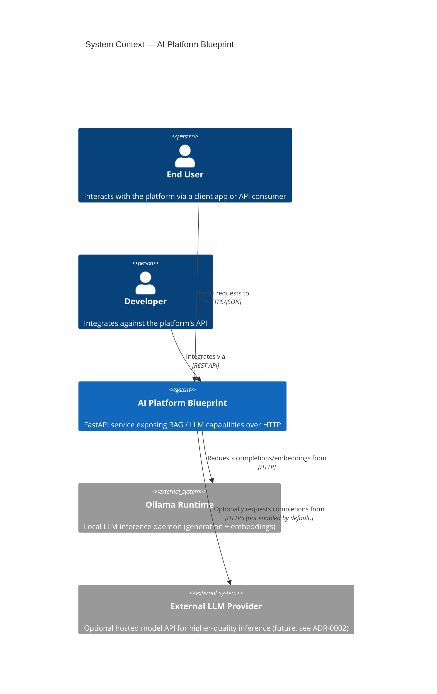
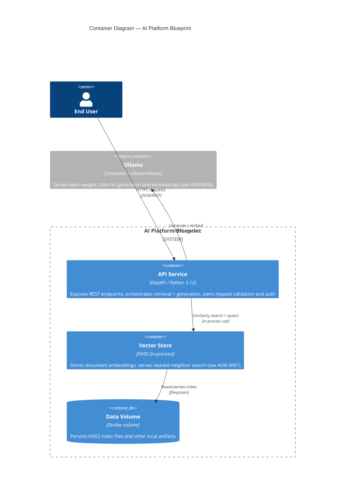

# C4 Model — AI Platform Blueprint

Architecture overview using the [C4 model](https://c4model.com/)
(Context → Container → Component), rendered in Mermaid.

## Level 1 — System Context

Who uses the platform, and what external systems does it talk to.

## Level 2 — Containers

The deployable units that make up the system and how they communicate.

## Level 3 — Components (API Service)

Internal structure spanning the `backend`, `ingestion`, `retrieval`,
`llm`, and `observability` top-level packages.

```mermaid
C4Component
    title Component Diagram — API Service

    Container_Boundary(api, "API Service") {
        Component(main, "App Factory", "backend/main.py", "Builds the FastAPI app, wires middleware and routers")
        Component(router, "API Router (v1)", "backend/api/v1", "Aggregates versioned endpoint routers")
        Component(deps, "Dependency Providers", "backend/api/deps.py", "Constructs OllamaClient / VectorStore per request; overridable in tests")
        Component(healthEp, "Health Endpoints", "backend/api/v1/endpoints/health.py", "Liveness (/health) and readiness (/health/ready) probes")
        Component(documentsEp, "Document Endpoints", "backend/api/v1/endpoints/documents.py", "Ingest (POST /documents) and search (POST /documents/search)")
        Component(config, "Settings", "backend/config/settings.py", "Typed configuration loaded from env / .env")
        Component(security, "API Key Auth", "backend/api/security.py", "Verifies the X-API-Key header against configured keys")
        Component(rateLimit, "Rate Limiter", "backend/api/rate_limit.py", "In-memory, per-key fixed-window request limiter")
        Component(ingestion, "Ingestion Service", "backend/services/ingestion_service.py", "Orchestrates chunk -> embed -> store for a document")
        Component(chunking, "Chunking", "ingestion/chunking/chunker.py", "Splits document text into overlapping chunks")
        Component(vectorPort, "VectorStore Port", "retrieval/vector_store/port.py", "Protocol abstraction over the vector backend")
        Component(faissStore, "FAISS Adapter", "retrieval/vector_store/faiss_store.py", "Implements VectorStore with a normalized IndexFlatIP + JSON payload sidecar")
        Component(ollamaClient, "Ollama Client", "llm/ollama/client.py", "Thin async HTTP client for the Ollama API (generate + embed)")
        Component(logging, "Logging Setup", "observability/logging/setup.py", "Structured JSON logging configuration")
    }

    Container_Ext(ollama, "Ollama", "Container")
    ContainerDb_Ext(datavol, "Data Volume")

    Rel(main, router, "includes")
    Rel(main, logging, "configures at startup")
    Rel(router, healthEp, "mounts")
    Rel(router, documentsEp, "mounts")
    Rel(healthEp, config, "reads settings from")
    Rel(healthEp, ollamaClient, "checks reachability via")
    Rel(documentsEp, deps, "resolves services via")
    Rel(documentsEp, security, "authenticates request via (through deps)")
    Rel(documentsEp, rateLimit, "throttles request via (through deps)")
    Rel(documentsEp, ingestion, "delegates ingest to")
    Rel(documentsEp, vectorPort, "delegates search to")
    Rel(ingestion, chunking, "splits text via")
    Rel(ingestion, ollamaClient, "embeds chunks via")
    Rel(ingestion, vectorPort, "stores vectors via")
    Rel(vectorPort, faissStore, "implemented by")
    Rel(ollamaClient, ollama, "HTTP", "generate / embed / version")
    Rel(faissStore, datavol, "persists index + payloads to")
```

## Notes

- Diagrams use Mermaid's native `C4Context` / `C4Container` / `C4Component`
  syntax and render directly on GitHub and in most Markdown previewers.
- The Component diagram reflects the state after Sprint 3: the `VectorStore`
  port has a FAISS adapter, the ingestion/chunking pipeline feeds it
  through the `/documents` and `/documents/search` endpoints (tracked
  alongside ADR-0001), and those two endpoints require a valid API key and
  are subject to a per-key rate limit (see ADR-0003).
- Keep this file in sync with the `backend`/`ingestion`/`retrieval`/`llm`/`observability` structure as new containers/components
  are added (e.g. a future ingestion worker, a Qdrant adapter, etc.).
