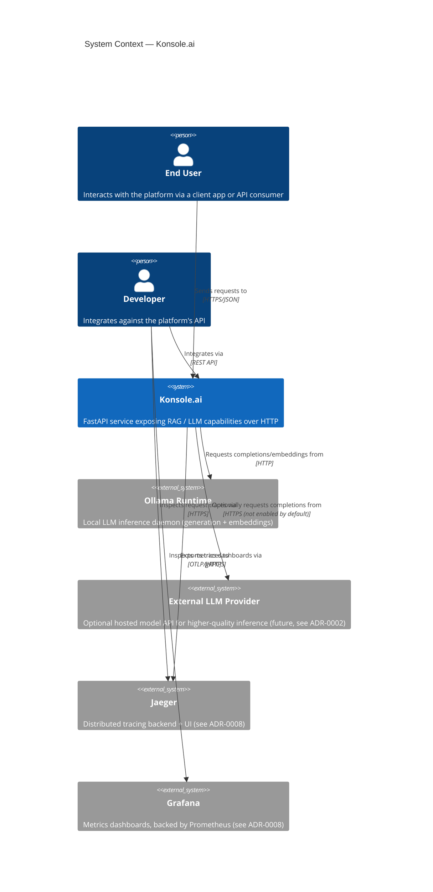
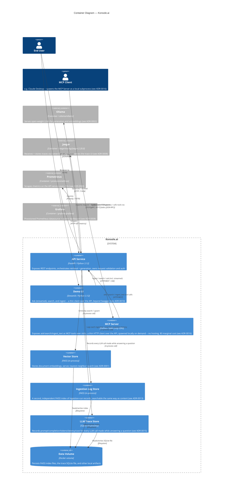

# C4 Model — Konsole.ai

Architecture overview using the [C4 model](https://c4model.com/)
(Context → Container → Component), rendered in Mermaid.

## Level 1 — System Context

Who uses the platform, and what external systems does it talk to.

## Level 2 — Containers

The deployable units that make up the system and how they communicate.

## Level 3 — Components (API Service)

Internal structure spanning the `backend`, `ingestion`, `retrieval`,
`llm`, and `observability` top-level packages.

```mermaid
C4Component
    title Component Diagram — API Service

    Container_Boundary(api, "API Service") {
        Component(main, "App Factory", "backend/main.py", "Builds the FastAPI app, wires middleware and routers")
        Component(router, "API Router (v1)", "backend/api/v1", "Aggregates versioned endpoint routers")
        Component(deps, "Dependency Providers", "backend/api/deps.py", "Constructs OllamaClient / VectorStore per request; overridable in tests")
        Component(healthEp, "Health Endpoints", "backend/api/v1/endpoints/health.py", "Liveness (/health) and readiness (/health/ready) probes")
        Component(documentsEp, "Document Endpoints", "backend/api/v1/endpoints/documents.py", "Ingest (POST /documents), upload (POST /documents/upload), search (POST /documents/search), ask (POST /documents/ask)")
        Component(observabilityEp, "Observability Endpoints", "backend/api/v1/endpoints/observability.py", "Read-only: recent LLM traces (GET /observability/traces) and aggregate cost/latency stats (GET /observability/summary) (see ADR-0015)")
        Component(config, "Settings", "backend/config/settings.py", "Typed configuration loaded from env / .env")
        Component(security, "API Key Auth", "backend/api/security.py", "Verifies the X-API-Key header against configured keys")
        Component(rateLimit, "Rate Limiter", "backend/api/rate_limit.py", "In-memory, per-key fixed-window request limiter")
        Component(ingestion, "Ingestion Service", "backend/services/ingestion_service.py", "Orchestrates chunk -> embed -> store for a document; ingest_document_stream() reports step-by-step progress and logs every run (see ADR-0013)")
        Component(loaders, "Document Loaders", "ingestion/loaders/dispatch.py", "Extracts text from PDF/HTML/TXT/Markdown by extension (see ADR-0005)")
        Component(generation, "Generation Service", "backend/services/generation_service.py", "Thin wrapper: builds the query graph once, invokes it per request; ask() blocks for the full answer, ask_stream() drives the same graph via astream() (see ADR-0007)")
        Component(queryGraph, "Query Graph", "llm/routing/query_graph.py", "LangGraph StateGraph: classify -> direct-answer, hybrid-retrieve -> rerank -> generate, or log-retrieve -> log-generate (see ADR-0006, ADR-0013)")
        Component(sse, "SSE Formatter", "backend/api/sse.py", "Formats an async event stream as Server-Sent Events; turns mid-stream exceptions into a final error event (see ADR-0007)")
        Component(chunking, "Chunking", "ingestion/chunking/chunker.py", "Splits document text into overlapping chunks")
        Component(vectorPort, "VectorStore Port", "retrieval/vector_store/port.py", "Protocol abstraction over the vector backend")
        Component(faissStore, "FAISS Adapter", "retrieval/vector_store/faiss_store.py", "Implements VectorStore with a normalized IndexFlatIP + JSON payload sidecar; exposes payloads() for BM25")
        Component(vectorRetriever, "Vector Retriever", "retrieval/retriever/langchain_retriever.py", "BaseRetriever wrapping VectorStore + embedding (see ADR-0004)")
        Component(bm25Retriever, "BM25 Retriever", "retrieval/retriever/bm25_retriever.py", "BaseRetriever rebuilding a rank_bm25 index from FAISS payloads each call (see ADR-0006)")
        Component(hybridRetriever, "Hybrid Retriever", "retrieval/retriever/hybrid.py", "Fuses vector + BM25 via langchain_classic's EnsembleRetriever (RRF); recomputes rank-based scores")
        Component(ragPrompt, "Prompts", "llm/prompts/*.py", "RAG / classify / rerank / direct-answer / log-answer ChatPromptTemplates")
        Component(ollamaClient, "Ollama Client", "llm/ollama/client.py", "Thin async HTTP client for the Ollama API (generate + embed)")
        Component(chatModel, "Chat Model", "backend/api/deps.py (get_chat_model)", "LangChain ChatOllama, injected for testability")
        Component(traceCallback, "LLM Trace Callback", "observability/llm_traces/callback.py", "AsyncCallbackHandler attached per-request; captures every chat-model call the Query Graph makes, tagged by node (see ADR-0015)")
        Component(traceStore, "LLM Trace Store", "observability/llm_traces/store.py", "SQLite-backed: records traces, serves recent()/summary() for the dashboard (see ADR-0015)")
        Component(logging, "Logging Setup", "observability/logging/setup.py", "Structured JSON logging; adds trace_id/span_id when a span is active (see ADR-0008)")
        Component(errors, "Error Handler", "backend/api/errors.py", "Catch-all for unhandled exceptions: safe JSON 500, always logged")
        Component(tracingSetup, "Tracing Setup", "observability/tracing/setup.py", "Builds the TracerProvider, instruments FastAPI + httpx; no-op unless Settings.TRACING_ENABLED (see ADR-0008)")
        Component(metricsSetup, "Metrics Setup", "observability/metrics/setup.py", "Exposes /metrics via prometheus-fastapi-instrumentator; no-op unless Settings.METRICS_ENABLED (see ADR-0008)")
    }

    Container_Ext(ollama, "Ollama", "Container")
    ContainerDb_Ext(datavol, "Data Volume")
    Container_Ext(jaeger, "Jaeger", "Container")
    Container_Ext(prometheus, "Prometheus", "Container")

    Rel(main, router, "includes")
    Rel(main, logging, "configures at startup")
    Rel(main, errors, "registers as catch-all exception handler")
    Rel(router, healthEp, "mounts")
    Rel(router, documentsEp, "mounts")
    Rel(router, observabilityEp, "mounts")
    Rel(observabilityEp, deps, "resolves LLM Trace Store via")
    Rel(observabilityEp, traceStore, "reads recent()/summary() from")
    Rel(healthEp, config, "reads settings from")
    Rel(healthEp, ollamaClient, "checks reachability via")
    Rel(documentsEp, deps, "resolves services via")
    Rel(documentsEp, security, "authenticates request via (through deps)")
    Rel(documentsEp, rateLimit, "throttles request via (through deps)")
    Rel(documentsEp, ingestion, "delegates ingest to")
    Rel(documentsEp, loaders, "extracts uploaded file text via")
    Rel(loaders, ingestion, "hands extracted text to")
    Rel(documentsEp, hybridRetriever, "delegates search to")
    Rel(documentsEp, generation, "delegates ask to")
    Rel(documentsEp, sse, "formats ask_stream() output via, when stream=true")
    Rel(ingestion, chunking, "splits text via")
    Rel(ingestion, ollamaClient, "embeds chunks via")
    Rel(ingestion, vectorPort, "stores vectors via")
    Rel(vectorPort, faissStore, "implemented by")
    Rel(ingestion, faissStore, "logs each run to a second instance of")
    Rel(generation, queryGraph, "builds once, invokes per request")
    Rel(generation, traceCallback, "attaches a fresh instance to each graph invocation")
    Rel(traceCallback, chatModel, "observes every call to, via LangGraph callbacks")
    Rel(traceCallback, traceStore, "persists each call to")
    Rel(traceStore, datavol, "persists SQLite file to")
    Rel(queryGraph, hybridRetriever, "retrieves context via (hybrid_retrieve node)")
    Rel(queryGraph, faissStore, "log_retrieve queries a second instance of")
    Rel(queryGraph, ragPrompt, "formats classify/rerank/generate/log-answer prompts via")
    Rel(queryGraph, chatModel, "classifies, reranks, and generates via")
    Rel(hybridRetriever, vectorRetriever, "fuses (RRF)")
    Rel(hybridRetriever, bm25Retriever, "fuses (RRF)")
    Rel(vectorRetriever, vectorPort, "searches via")
    Rel(vectorRetriever, ollamaClient, "embeds the query via")
    Rel(bm25Retriever, faissStore, "reads payloads() from")
    Rel(chatModel, ollama, "HTTP", "chat completion")
    Rel(ollamaClient, ollama, "HTTP", "generate / embed / version")
    Rel(faissStore, datavol, "persists index + payloads to")
    Rel(main, tracingSetup, "instruments app + httpx at startup")
    Rel(main, metricsSetup, "exposes /metrics at startup")
    Rel(tracingSetup, jaeger, "exports spans to", "OTLP/gRPC")
    Rel(tracingSetup, logging, "spans read by, for trace_id/span_id correlation")
    Rel(prometheus, metricsSetup, "scrapes", "HTTP GET /metrics")
```

## Notes

- Diagrams use Mermaid's native `C4Context` / `C4Container` / `C4Component`
  syntax and render directly on GitHub and in most Markdown previewers.
- The Component diagram reflects the state after this ADR-0013 sprint: the `VectorStore`
  port has a FAISS adapter, the ingestion/chunking pipeline feeds it
  through `/documents` (tracked alongside ADR-0001), all four document
  endpoints require a valid API key and are subject to a per-key rate
  limit (see ADR-0003), `/documents/upload` extracts text from
  PDF/HTML/TXT/Markdown files before feeding the same ingestion pipeline
  (ADR-0005), any unhandled exception in any endpoint returns a safe,
  logged JSON 500 instead of leaking internals (`backend/api/errors.py`),
  and both `/documents/search` and `/documents/ask` retrieve via the
  Hybrid Retriever (vector + BM25 fused by RRF). `/documents/ask` additionally
  runs the LangGraph Query Graph: classify -> direct-answer, or
  hybrid-retrieve -> rerank -> generate, all via the local SLM
  (ADR-0004, ADR-0006). When the request sets `"stream": true`, the same
  Generation Service drives the same Query Graph via `astream()` instead
  of `ainvoke()`, and the Document Endpoints route its output through the
  SSE Formatter instead of returning a single JSON body (ADR-0007).
  Tracing Setup and Metrics Setup are wired into the App Factory at
  startup, both disabled by default (`Settings.TRACING_ENABLED` /
  `Settings.METRICS_ENABLED`) and enabled only when running with the
  `docker-compose.yml` "observability" Compose profile, where Jaeger,
  Prometheus, and Grafana run as sibling containers (ADR-0008,
  ADR-0011). Without that profile, `docker compose up` starts only
  `api`/`ollama`/`ui`.
- The Demo UI (Container level only -- it's two files, `ui/app.py` +
  `ui/api_client.py`, deliberately not broken out into its own
  Component diagram) is a separate deployable with its own image and
  dependencies, talking to the API purely over HTTP -- it never imports
  backend code (ADR-0010).
- The MCP Server (Container level only, same reasoning as the Demo UI
  -- three small files, not broken out into its own Component diagram)
  is the same kind of external consumer as the Demo UI: talks to the
  API only over HTTP, never imports backend code. Unlike the Demo UI it
  is never a standing container -- there's no `docker-compose.yml`
  service for it, since an MCP client spawns it as a local subprocess
  over stdio on demand, so it costs nothing when not in use (ADR-0016).
- The Ingestion Log Store (Container level) and the second `faissStore`
  instance it maps to (Component level) are the *same* `FaissVectorStore`
  class as the content Vector Store -- a second instance at a different
  path (`Settings.LOG_VECTOR_STORE_PATH`), not new code. Kept as a
  fully separate index from content on purpose, so a content question
  never surfaces an ingestion-log fragment (ADR-0013).
- The LLM Trace Store is the project's first SQL-backed component --
  a per-request LLM Trace Callback attached to the Query Graph's own
  `.ainvoke()`/`.astream()` call captures every chat-model call it
  makes (prompt, completion, tokens, latency, estimated cost),
  attributed to the LangGraph node that triggered it, and persists each
  one to SQLite; the Observability Endpoints expose it read-only for
  the Demo UI's Observability tab (ADR-0015). It's a foundation for a
  future automated eval harness, not built yet (ADR-0015's revisit
  triggers).
- Keep this file in sync with the `backend`/`ingestion`/`retrieval`/`llm`/`observability` structure as new containers/components
  are added (e.g. a future ingestion worker, a Qdrant adapter, etc.).
