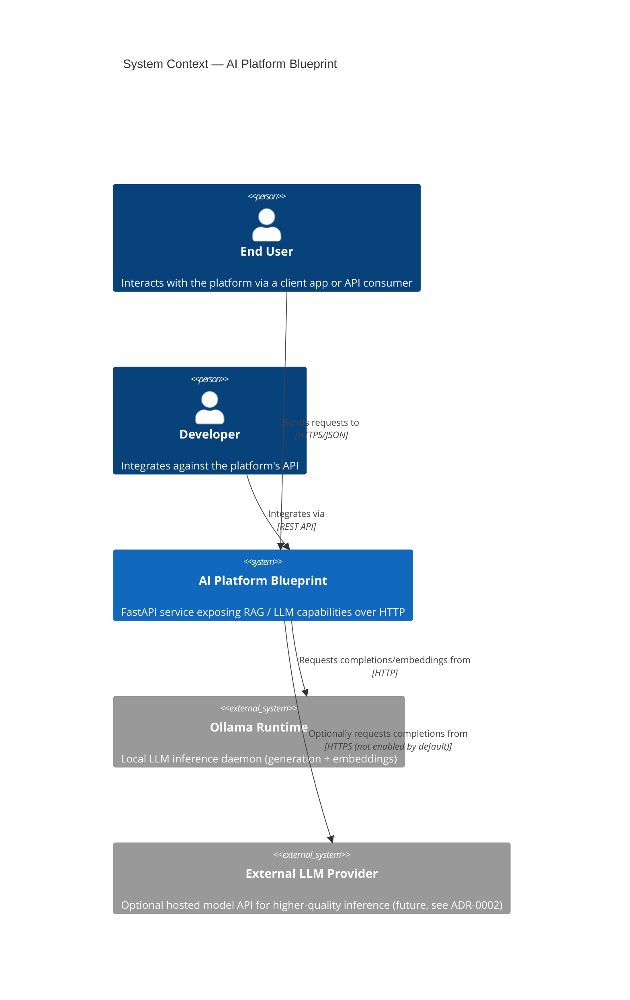
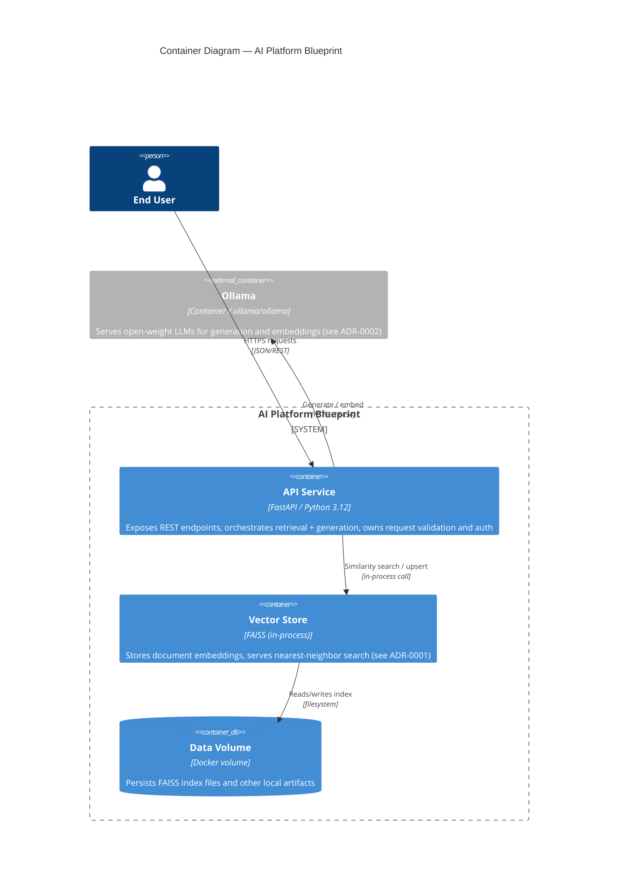
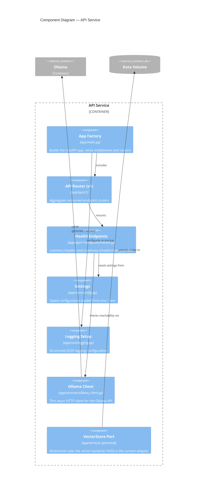

# C4 Model — AI Platform Blueprint

Architecture overview using the [C4 model](https://c4model.com/)
(Context → Container → Component), rendered in Mermaid.

## Level 1 — System Context

Who uses the platform, and what external systems does it talk to.

## Level 2 — Containers

The deployable units that make up the system and how they communicate.

## Level 3 — Components (API Service)

Internal structure of the `api` container, mirroring the `app/` package
layout.

## Notes

- Diagrams use Mermaid's native `C4Context` / `C4Container` / `C4Component`
  syntax and render directly on GitHub and in most Markdown previewers.
- The Component diagram reflects the state after Sprint 1: health/readiness
  wiring and the Ollama client exist; the `VectorStore` port/FAISS adapter
  is the next piece of work (tracked alongside ADR-0001).
- Keep this file in sync with `app/` structure as new containers/components
  are added (e.g. a future ingestion worker, a Qdrant adapter, etc.).
